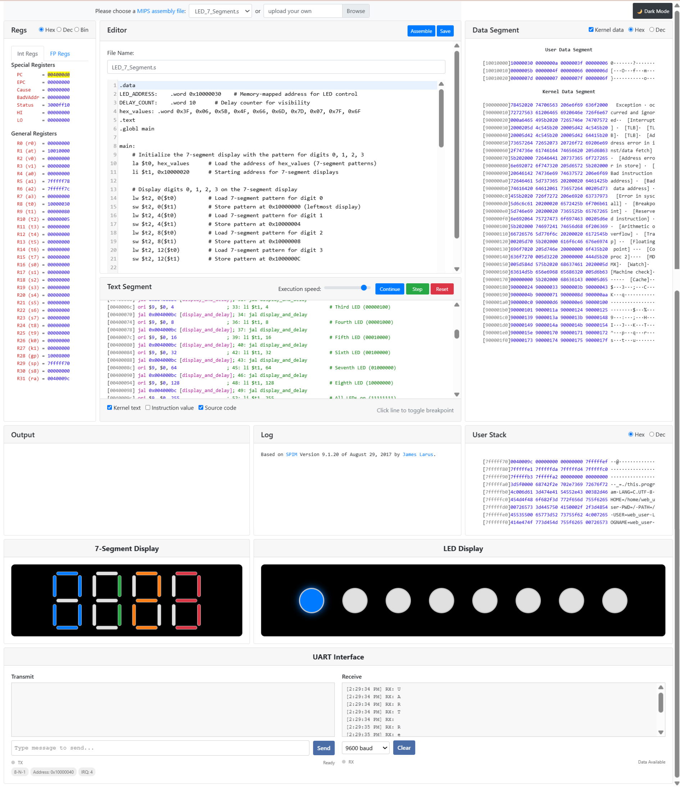
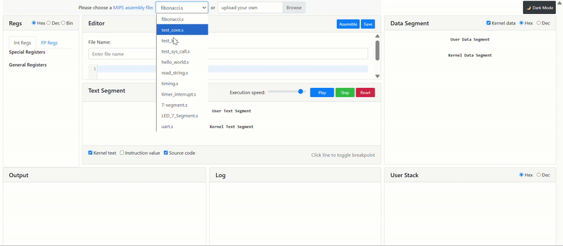

# Embedded System Simulation Framework
This is a modified version of [JsSpim](https://github.com/ShawnZhong/JsSpim), which itself is an online adaptation of **Prof. James Larus’s Spim**.  
It provides a modernized web interface, new editing capabilities, and additional peripheral visualizations for MIPS32 simulation and learning.

## Background

**Spim** a simulator that runs MIPS32 assembly programs and provides a simple debugger and OS services.

**JsSpim** extended Spim by compiling it to WebAssembly (via Emscripten), creating an interactive web-based environment, and adding some features.

**This simulator** builds further on **JsSpim**, focusing on enhanced usability, visualization, and educational tools, especially for OS course.

---

> *Spim* is a self-contained simulator that runs MIPS32 programs. It reads and executes assembly language programs written for this processor. *Spim* also provides a simple debugger and minimal set of operating system services. *Spim* does not execute binary (compiled) programs.
>
> *Spim* implements almost the entire MIPS32 assembler-extended instruction set. (It omits most floating point comparisons and rounding modes and the memory system page tables.) The MIPS architecture has several variants that differ in various ways (e.g., the MIPS64 architecture supports 64-bit integers and addresses), which means that *Spim* will not run programs for all MIPS processors.

## New Features Implemented

### User Interface Improvements
- Dark Theme Mode
  Provides a sleek and eye-friendly dark mode for long coding sessions

---

### Integrated Code Editor (CodeMirror)
- Replaced the basic text area with **CodeMirror**, providing:
  - Syntax highlighting for MIPS assembly
  - Line numbering and auto-indentation
  - A better, more interactive editing experience directly in the browser
    
---

### Peripheral Simulation
- **7-Segment Display**  
  Displays numeric output in a color-coded, aligned layout.
- **LED Display**  
  Circular LED lights with glow effects for ON/OFF states.
- **UART Interface**  
  Basic serial communication simulation with:
  - Data register: `0x10000040`  
  - Status register: `0x10000044`  
  - Control register: `0x10000048`

---

## Screenshot

## Screen Record

## Features

- Click on an instruction to toggle **breakpoint**
- Use the range slider to **control the execution speed**
- **Highlight** on changed registers, data segment, and stack
- **Radix** support for all values
- **7-Segment** and **LED** features for simulation
- **UART** interface

## Built With

- [Spim](http://spimsimulator.sourceforge.net/) - The original simulator written in C++
- [JsSpim](https://github.com/ShawnZhong/JsSpim) - The web-based extended version of Spim by Shawn Zhong
- [Emscripten](https://emscripten.org/) - Toolchain to compile C++ source code to WebAssembly using the LLVM IR.
- [Bootstrap](https://getbootstrap.com/)  - Using the CSS library to build the UI
- [highlight.js](https://highlightjs.org/) - For highlighting the source code
- [CodeMirror](https://codemirror.net/) - In-browser code eitor

